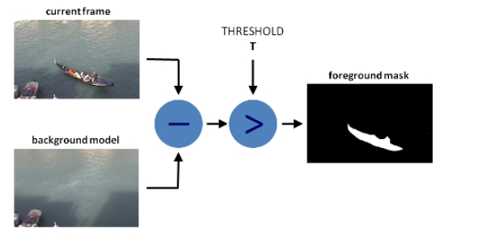
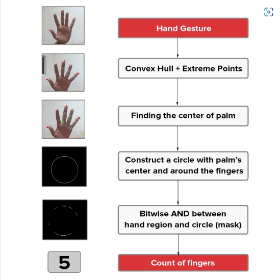
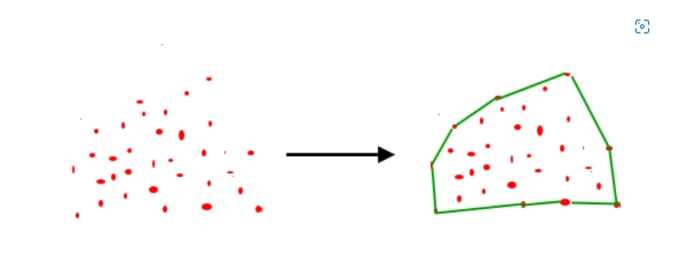
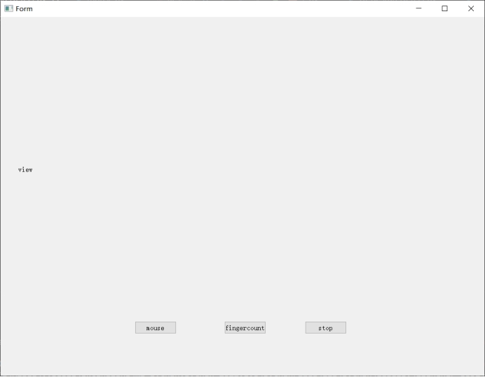
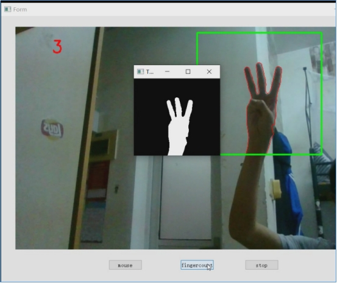
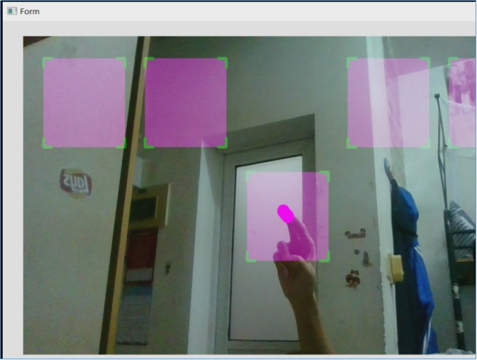

# gesture-recognition
finger count and virtual mouse

目录

[1. 需求分析	](#_Toc4752 )

[（1） 系统的输入；	](#_Toc5384 )

[（2） 系统的输出；	](#_Toc18859 )

[（3） 系统实现的功能。	](#_Toc8784 )

[2. 概要设计	](#_Toc29860 )

[2.1手指计数	](#_Toc26897 )

[2.2 虚拟鼠标	](#_Toc2304 )

[3. 详细设计	](#_Toc13125 )

[3.1手指计数	](#_Toc20784 )

[3.2 虚拟鼠标	](#_Toc12400 )

[3.3 Qt界面设计	](#_Toc31258 )

[4. 实验结果与分析	](#_Toc28557 )

 

 

 

 

 

 

## 1. **需求分析**

### **（1）*****\*系统的输入；\****

使用cv2.VideoCapture(0)读取摄像机得到的视频

### **（2）*****\*系统的输出；\****

经过算法识别后得到的手势识别效果图

### **（3）*****\*系统实现的功能。\****

产生一个QT的界面，通过点击界面中的按钮触发计算摄像机的到的视频中手指数量的功能，和使用虚拟鼠标的功能。

## 2. **概要设计**

### ***\*2.1手指计数\****

#### **2.1.1背景减法**

我们需要一种有效的方法来分离前景和背景。为此，我们使用运行平均值的概念。我们使系统在特定场景中查看30帧。在此期间，我们计算当前帧和前一帧的运行平均值。通过这样做，我们基本上告诉我们的系统这 30 帧的运行平均值是背景。

 

在使用运行平均值计算出背景模型后，我们使用当前帧，除了背景之外，它还保存前景对象（在我们的例子中是手）。我们计算背景模型（随时间更新）和当前帧（有我们的手）之间的绝对差值，以获得保存新添加的前景对象（即我们的手）的差异图像。这就是背景减法的全部意义所在。

#### **2.1.2****移动侦测和阈值**

为了从这个差异图像中检测手部区域，我们需要对差分图像进行阈值将像素强度减少到0和1，以便只有我们的手部区域变得可见，而所有其他不需要的区域都被涂成黑色。这就是运动检测的全部意义所在。

#### **2.1.3****轮廓提取**

对差分图像进行阈值后，我们在生成的图像中找到轮廓。**面积最大的**轮廓假设为我们的手（轮廓是位于图像中的对象的轮廓或边界）。

 

#### **2.1.4手指计数**

 

***\*轮廓\****

感兴趣对象的轮廓或边界。等值线定义为沿图像边界连接具有相同强度的所有点的线。OpenCV中的cv2.findContours（）函数帮助我们在二进制图像中查找轮廓。如果将二进制图像传递给此函数，它将返回图像中所有轮廓的列表。此列表中的每个元素都是一个 numpy 数组，表示轮廓（或对象）边界点的 （x， y） 坐标。

***\*按位和\****

在两个对象之间执行按位逻辑 AND。在视觉上将其视为使用mask并提取图像中仅位于此mask下方的区域。OpenCV 提供 cv2.bitwise_and（） 函数来执行此操作 - [按位 AND](http://docs.opencv.org/trunk/d0/d86/tutorial_py_image_arithmetics.html)。

***\*欧氏距离\****

这是[由此处](https://bigsnarf.files.wordpress.com/2012/03/distance.jpg)所示的等式给出的两点之间的距离。Scikit-learn提供了一个名为pairwise.euclidean_distances（）的函数，用于计算一行代码中从一个点到多个点的欧[氏距离 - 成对欧几里得距离](http://scikit-learn.org/stable/modules/generated/sklearn.metrics.pairwise.euclidean_distances.html)。之后，我们使用NumPy的argmax（）函数取所有这些距离的最大值。

#### **2.1.5凸包算法**

给定平面中的一组点。集合的凸壳是包含其所有点的最小凸多边形。

 

**算法：**

**步骤1）**将p初始化为最左边的点。

**步骤2）**当我们不回到第一个（或最左边）点时，请遵循。

**2.1）** 下一个点 q 是点，使得三元组 （p， q， r） 对于任何其他点 r 都是逆时针方向的。

为了找到这一点，我们只需将q初始化为下一个点，然后遍历所有点。

对于任何点 i，如果 i 更逆时针，即 orientation（p， i， q） 是逆时针方向，则我们将 q 更新为 i。

q 的最终值将是逆时针方向最逆时针的点。

**2.2）** next[p] = q （将 q 作为 p 的下一个存储在输出凸壳中）。

**2.3）** p = q （将 p 设置为 q 以供下一次迭代使用）。

 

 

 

### ***\*2.2 虚拟鼠标\****

#### **Cvzone**

利用与计算机视觉相关的库，编程实现虚拟鼠标功能，并将两个功能结合，用一个Qt界面展示

## 4. **实验结果与分析**

基础界面如下，简单设计了适合展示功能的界面上面部分用于展示视频，下面是几个用于操作的按钮。

 

 

手指计数如下

 

虚拟鼠标如下

 

***\*分析：\****

整体来看手指计数并没有像虚拟鼠标功能一样主要靠调库，实现的效果远比不上，当然是cvzone库的优秀使然。
